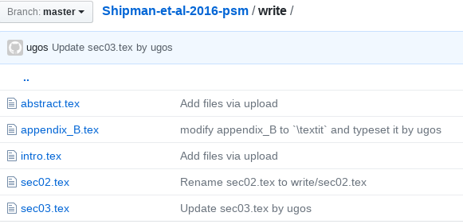

# Shipman, Swanquist, and Whited (2016) の解題

## 各節の修正について

- ひととおり完成した節については、内容を変更するような重要な修正でないかぎり、執筆者への許可無しで修正できるようにしましょう。
- ということで、各ファイルになんらかの変更を加える際には、*必ず github 上の最新のファイルを pull してから*執筆をおこなってください。
- たとえば、以下の図
  
  のように、`gyutan*` さんに作成してもらったファイルは `ugos` によって編集されています。再度編集する際は、ローカル (自身の PC) 上にあるファイルではなく、ここにあげられているファイルをスタートポイントとして実施してください。
- 各人がどのような編集をおこなったかについては、History 等から確認できます。

## ディレクトリ概要

- main
    - LaTeX をコンパイルするディレクトリ。各節の文書は write/sec0x.tex で執筆
    - tmp.tex はとりあえずで作成したものです。header 等を付けた、かっこいいものに変えてもらって結構です。
- write
    - 各節の文書を格納するディレクトリ
- table
    - 表ファイルを格納するディレクトリ
    
## 文書作成規約

- フォントサイズは 11pt に設定しています。
- 見出しを付ける際には、 `\paragraph{}` を使ってください。

## その他

他の節を解題する際の参考とするため、原稿は執筆中でも積極的にあげてもらえると幸いです。
任意のタイミングで修正、削除等できます。

指摘等は、`*.tex` ファイルにコメント文として書きこんでもよいし、
あるいは、github の Issues に記載してください。
